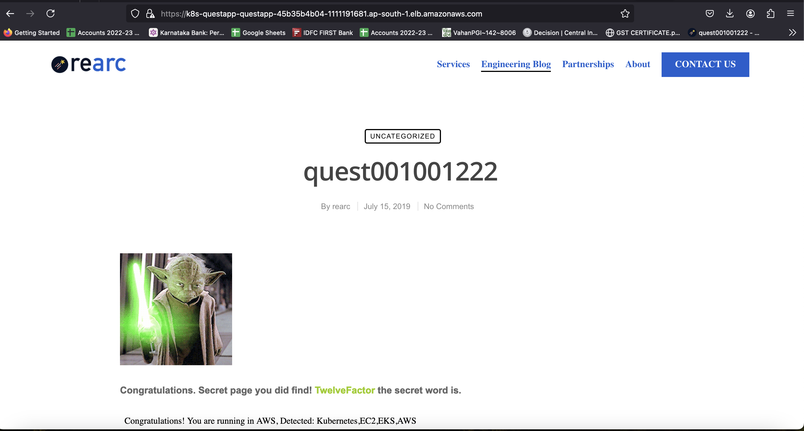

# Project Screenshots

This document contains screenshots taken during the project setup and deployment process. 

Application Endpoint - https://k8s-questapp-questapp-45b35b4b04-1111191681.ap-south-1.elb.amazonaws.com/

## Screenshots

### 1. Terraform output of S3 bucket and Dynamo DB Table for Storing State File on S3 Bucket Securedly 

### 2. S3 Bucket on AWS

### 3. Dynamo DB tabel on AWS

### 4. Terraform Output of IAM-Role terraform code.

### 5. Terraform Ouput of EKS cluster and VPC

### 6. EKS Cluster on AWS

### 7. VPC on AWS

### 8. Kubernetes output - Cluster Info, Namespace, Deployment, Services, Ingreess, ALB Contoller

### 9. Access Web Page using Port Forward to get the Secret Word

### 10. Upload Self Signed Certifcate Generated on local to ACM

### 11. Application with HTTPS

### 12. Docker check

### 13. Loadbalance check

### 14. TLS check
